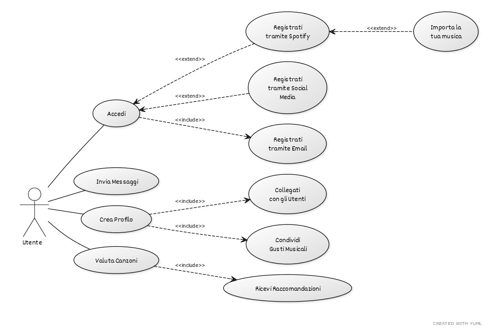

# TuneMatch

Login
Input:
{
    "User": "David",
    "Password": "Davide"
}

Output:
{
    "Name": "David",
    "Surname": "Borali",
    "isAdmin": false,
    "DateOfBirth": "23/12/2006",
    "Position": "Bergamo",
    "Id": "787fdsgs37t"
}

Message
Input:
{
    "Message": "<message>",
    "Date": "23/12/2024"
}

Output:
{
    "Message": "<other user response>",
    "Date": "23/12/2024"
}

Liked 
Input:
{
    "Id": "787fdsgs37t"
}

Output:
{
    "like": [
        "all stars"
    ]
}

# Requisiti Funzionali
Connessione all'Account Spotify

Gli utenti possono collegare il proprio account Spotify per accedere alla loro libreria musicale e alle playlist.
Interazione tramite Messaggi e Profilo

Gli utenti possono inviare messaggi diretti tra di loro.
Gli utenti possono creare profili personalizzati.
Gli utenti possono condividere gusti musicali e connettersi con altri utenti con interessi simili.
Classifica dei Brani Preferiti

Gli utenti possono esprimere le loro preferenze sui brani tramite un sistema di "like".
Il sistema categorizza i brani in base al genere musicale.
Gli utenti ricevono raccomandazioni personalizzate in base ai loro ascolti.
Login/Registrazione

Gli utenti possono registrarsi tramite email, social media e Spotify.
Il processo di login deve essere semplice e intuitivo.

# Requisiti Non Funzionali
Usabilità

L'interfaccia deve essere intuitiva e facile da navigare.
Sicurezza

I dati degli utenti devono essere protetti, specialmente durante il processo di login e la gestione delle informazioni personali.
Prestazioni

L'app deve caricarsi rapidamente e gestire le interazioni in tempo reale senza ritardi significativi.
Scalabilità

L'app deve essere in grado di gestire un numero crescente di utenti e interazioni senza compromettere le prestazioni.
Compatibilità

L'app deve essere compatibile con diverse piattaforme (iOS, Android, web).

# Requisiti di Dominio
Gestione della Musica

Deve supportare l'integrazione con il servizio di streaming musicale di Spotify, gestendo l'accesso alla libreria musicale e alle playlist.
Social Networking

Deve permettere interazioni sociali tra gli utenti, inclusa la creazione di reti e connessioni basate su interessi musicali comuni.
Raccomandazione Musicale

Deve utilizzare algoritmi per suggerire brani e artisti in base alle preferenze espresse dagli utenti e al loro comportamento di ascolto.

