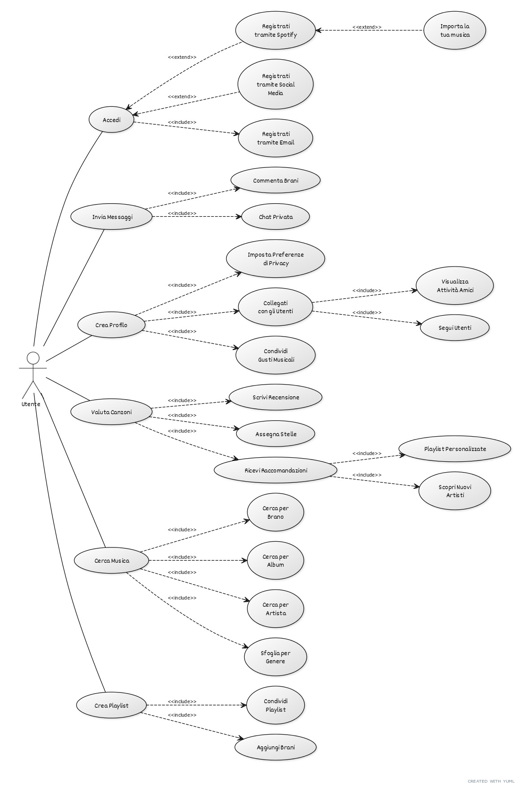

# TuneMatch
### Un'app che ti connette con persone in base ai tuoi gusti musicali, utilizzando l'intelligenza artificiale.

TuneMatch analizza le tue canzoni preferite per creare abbinamenti con utenti simili. Oltre a trovare nuove connessioni, l’app ti suggerisce brani e artisti in linea con i tuoi gusti e quelli delle persone con cui vieni abbinato, migliorando l’esperienza musicale e sociale.

## Target
Giovani che vogliono connettersi con altri persone tramite la musica.

## Problema
Molte persone non hanno amici con gusti musicali simili o hanno difficoltà a trovare community in cui condividere la propria passione per specifici generi o artisti.

## Competitor
* Tastebuds
* Vampr
* Last.fm
* TikTok
* Jammber

## Tecnologie usate
* GIT
* VUE
* NODEJS
* WEBSOCKET

### Esempi di API

#### Login
* Input: `{ "User": "David", "Password": "Davide" }`
* Output: `{ "Name": "David", "Surname": "Borali", "isAdmin": false, "DateOfBirth": "23/12/2006", "Position": "Bergamo", "Id": "787fdsgs37t" }`

#### Message
* Input: `{ "Message": "<message>", "Date": "23/12/2024" }`
* Output: `{ "Message": "<other user response>", "Date": "23/12/2024" }`

#### Liked
* Input: `{ "Id": "787fdsgs37t" }`
* Output: `{ "like": [ "all stars" ] }`

## Requisiti
Connessione all'Account Spotify

* Permetti agli utenti di collegare il proprio account Spotify per accedere facilmente alla loro libreria musicale e alle playlist.

Interazione tramite Messaggi e Profilo

* Consenti agli utenti di relazionarsi tra loro attraverso messaggi diretti e la creazione di profili personalizzati, dove possono condividere i propri gusti musicali e scoprire nuovi amici con interessi simili.

Classifica dei Brani Preferiti

* Implementa un sistema di classificazione dei brani preferiti basato su ""like"" e sul genere musicale. Gli utenti possono esprimere le loro preferenze e ricevere raccomandazioni personalizzate in base ai loro ascolti.

Login/Registrazione

* Rendi il processo di login e registrazione semplice e intuitivo. Offri opzioni di accesso tramite email, social media e, naturalmente, Spotify, per facilitare l'ingresso nell'app.

## Requisiti Funzionali

### 1. Connessione all'Account Spotify
Gli utenti possono collegare il proprio account Spotify per accedere alla loro libreria musicale e alle playlist.

### 2. Interazione tramite Messaggi e Profilo
* Gli utenti possono inviare messaggi diretti tra di loro.
* Gli utenti possono creare profili personalizzati.
* Gli utenti possono condividere gusti musicali e connettersi con altri utenti con interessi simili.

### 3. Classifica dei Brani Preferiti
* Gli utenti possono esprimere le loro preferenze sui brani tramite un sistema di "like".
* Il sistema categorizza i brani in base al genere musicale.
* Gli utenti ricevono raccomandazioni personalizzate in base ai loro ascolti.

### 4. Login/Registrazione
* Gli utenti possono registrarsi tramite email, social media e Spotify.
* Il processo di login deve essere semplice e intuitivo.

## Requisiti Non Funzionali

### 1. Usabilità
L'interfaccia deve essere intuitiva e facile da navigare.

### 2. Sicurezza
I dati degli utenti devono essere protetti, specialmente durante il processo di login e la gestione delle informazioni personali.

### 3. Prestazioni
L'app deve caricarsi rapidamente e gestire le interazioni in tempo reale senza ritardi significativi.

### 4. Scalabilità
L'app deve essere in grado di gestire un numero crescente di utenti e interazioni senza compromettere le prestazioni.

### 5. Compatibilità
L'app deve essere compatibile con diverse piattaforme (iOS, Android, web).

## Requisiti di Dominio

### 1. Gestione della Musica
Deve supportare l'integrazione con il servizio di streaming musicale di Spotify, gestendo l'accesso alla libreria musicale e alle playlist.

### 2. Social Networking
Deve permettere interazioni sociali tra gli utenti, inclusa la creazione di reti e connessioni basate su interessi musicali comuni.

## Casi d'uso



# Guida all'Installazione di TuneMatch con Docker

Questa guida spiega come installare Docker, configurare Docker Compose e avviare l'applicazione TuneMatch utilizzando Docker su vari sistemi operativi.

## Prerequisiti

Prima di iniziare, assicurati di avere quanto segue:

*   Un computer con sistema operativo Windows, Linux o macOS.
*   Scaricato la repository di github sul tuo PC
*   Docker e Docker Compose installati.
*   Un file `.env` configurato con le credenziali API necessarie (Spotify, Twitch, Google OAuth).

## Il File `.env`

Il file `.env` contiene le variabili d'ambiente necessarie per configurare l'applicazione TuneMatch.  **È fondamentale che questo file sia mantenuto sicuro e non venga condiviso o incluso in repository pubblici (come GitHub).**

Il formato del file `.env` deve essere il seguente:

```
NODE_ENV=development
PORT=3000
SPOTIFY_CLIENT_ID=TUO_SPOTIFY_CLIENT_ID
SPOTIFY_CLIENT_SECRET=TUO_SPOTIFY_CLIENT_SECRET
SPOTIFY_CALLBACK_URL=http://localhost:3000/auth/spotify/callback
TWITCH_CLIENT_ID=TUO_TWITCH_CLIENT_ID
TWITCH_CLIENT_SECRET=TUO_TWITCH_CLIENT_SECRET
TWITCH_CALLBACK_URL=https://marcpado.it/auth/twitch/callback
GOOGLE_CLIENT_ID=TUO_GOOGLE_CLIENT_ID
GOOGLE_CLIENT_SECRET=TUO_GOOGLE_CLIENT_SECRET
GOOGLE_CALLBACK_URL=http://localhost:3000/auth/google/callback
USE_MOCK_DB=false
```

**Sostituisci i segnaposto `TUO_*` con i valori reali delle tue API.**

*   `NODE_ENV`: Imposta l'ambiente di esecuzione. `development` per sviluppo locale, `production` per produzione.
*   `PORT`:  La porta su cui il server Node.js ascolterà.
*   `SPOTIFY_CLIENT_ID`, `SPOTIFY_CLIENT_SECRET`: Le credenziali della tua applicazione Spotify. Ottenibili dal pannello sviluppatori Spotify.
*   `SPOTIFY_CALLBACK_URL`: L'URL a cui Spotify reindirizzerà l'utente dopo l'autenticazione.
*   `TWITCH_CLIENT_ID`, `TWITCH_CLIENT_SECRET`: Le credenziali della tua applicazione Twitch. Ottenibili dal pannello sviluppatori Twitch.
*   `TWITCH_CALLBACK_URL`: L'URL a cui Twitch reindirizzerà l'utente dopo l'autenticazione.
*   `GOOGLE_CLIENT_ID`, `GOOGLE_CLIENT_SECRET`: Le credenziali della tua applicazione Google OAuth. Ottenibili dalla console Google Cloud.
*   `GOOGLE_CALLBACK_URL`: L'URL a cui Google reindirizzerà l'utente dopo l'autenticazione.
*   `USE_MOCK_DB`: Imposta su `true` per usare un database di esempio (solo per sviluppo), `false` per utilizzare un database reale.

## Installazione di Docker

### Windows

1.  **Scarica Docker Desktop:**

    *   Visita la [pagina di Docker Desktop per Windows](https://www.docker.com/products/docker-desktop).
    *   Scarica l'installer.

2.  **Installa Docker:**

    *   Esegui l'installer scaricato e segui le istruzioni.
    *   Dopo l'installazione, Docker dovrebbe avviarsi automaticamente.

3.  **Verifica l'Installazione:**

    *   Apri il Prompt dei comandi ed esegui:

        ```
        docker --version
        ```

    *   Dovresti vedere la versione di Docker stampata nel terminale.

### macOS

1.  **Scarica Docker Desktop:**

    *   Visita la [pagina di Docker Desktop per Mac](https://www.docker.com/products/docker-desktop).
    *   Scarica l'installer.

2.  **Installa Docker:**

    *   Apri il file scaricato e trascina l'icona di Docker nella cartella Applicazioni.
    *   Avvia Docker dalle Applicazioni.

3.  **Verifica l'Installazione:**

    *   Apri il Terminale ed esegui:

        ```
        docker --version
        ```

    *   Il comando dovrebbe restituire la versione installata di Docker.

### Linux (Ubuntu)

Il processo di installazione di Docker su Linux varia a seconda della distribuzione. Per Ubuntu, segui questi passaggi:

1.  **Aggiorna il Database dei Pacchetti:**

    ```
    sudo apt update
    ```

2.  **Installa Docker:**

    ```
    sudo apt install docker.io
    ```

3.  **Abilita e Avvia Docker:**

    ```
    sudo systemctl enable --now docker
    ```

4.  **Verifica l'Installazione:**

    ```
    docker --version
    ```

## Installazione di Docker Compose

### Windows & macOS

Docker Compose è incluso in Docker Desktop. Non è necessaria un'installazione aggiuntiva.

### Linux (Ubuntu)

1.  **Scarica il Binario di Docker Compose:**

    ```
    sudo curl -L "https://github.com/docker/compose/releases/download/1.29.2/docker-compose-$(uname -s)-$(uname -m)" -o /usr/local/bin/docker-compose
    ```

2.  **Applica i Permessi di Esecuzione:**

    ```
    sudo chmod +x /usr/local/bin/docker-compose
    ```

3.  **Verifica l'Installazione:**

    ```
    docker-compose --version
    ```

## Avvio di TuneMatch con Docker

Hai due opzioni principali per avviare l'applicazione TuneMatch: utilizzare script di avvio o avviare manualmente.

### Opzione 1: Utilizzo degli Script di Avvio

#### Windows

**Utilizzo di `start.bat`:**

Fai doppio clic sul file `start.bat` o eseguilo dal Prompt dei comandi:

```
start.bat
```


Questo script eseguirà:

*   Verifica se Docker è installato.
*   Verifica se Docker Compose è disponibile.
*   Conferma l'esistenza del file `.env`.
*   Costruisce e avvia i container.
*   Conferma che i servizi sono in esecuzione.

#### Linux(Ubuntu)/macOS

**Utilizzo di `start.sh`:**

1.  Rendi lo script eseguibile:

    ```
    chmod +x start.sh
    ```

2.  Esegui lo script:

    ```
    ./start.sh
    ```

Lo script esegue gli stessi controlli e avvia i container.

### Opzione 2: Avvio Manuale

Se preferisci eseguire i comandi manualmente, segui questi passaggi:

1.  Apri il terminale (o il Prompt dei comandi su Windows) e vai alla directory del progetto TuneMatch.

2.  Esegui il seguente comando per costruire e avviare i container in modalità detached:

    ```
    docker-compose up --build -d
    ```

## Accesso ai Servizi

Una volta che i container sono in esecuzione, puoi accedere ai servizi TuneMatch utilizzando il tuo browser web:

*   **Frontend (Applicazione Vue.js):** `http://localhost:8080`
*   **Backend (Server Node.js Express):** `http://localhost:3000`
*   **Documentazione API:** `http://localhost:3000/api-docs`
